# WebSocket & Socket.IO — Complete Notes

---

## 1. WebSocket Kya Hai?

WebSocket ek communication protocol hai jo client aur server ke beech ek **persistent, two-way connection** banata hai.
Normal HTTP mein client request karta hai, server respond karta hai, aur connection band ho jati hai.
WebSocket mein connection ek baar banta hai aur open rehta hai jab tak dono sides band na karein.
Iska matlab hai server bhi apni marzi se client ko data bhej sakta hai — client ko baar baar request nahi karni padti.
Yeh real-time applications ke liye ideal hai jaise chat, live notifications, online games, stock prices.
Browser aur server dono WebSocket support karte hain natively — koi extra plugin nahi chahiye.

```
HTTP:
Client ──── Request ───► Server
Client ◄─── Response ─── Server   (connection close)

WebSocket:
Client ◄══════ Open Connection ══════► Server
Client ──── Message ───► Server        (kabhi bhi)
Client ◄─── Message ──── Server        (kabhi bhi)
```

| | HTTP | WebSocket |
|---|---|---|
| Connection | Har request pe naya | Ek baar, open rehta hai |
| Direction | Client → Server | Dono taraf |
| Real-time | Nahi | Haan |
| Use case | REST APIs | Chat, notifications, live data |

---

## 2. Socket.IO Kya Hai?

Socket.IO ek JavaScript library hai jo WebSocket ke upar kaam karti hai aur extra features deti hai.
Pure WebSocket sirf raw messages bhejta hai — Socket.IO uske upar **events, rooms, namespaces, aur auto-reconnect** deta hai.
Agar browser WebSocket support nahi karta toh Socket.IO automatically HTTP long-polling pe fallback kar leta hai.
NestJS mein `@nestjs/websockets` aur `@nestjs/platform-socket.io` packages use hote hain.
Client side pe `socket.io-client` library use hoti hai — browser ya Node.js dono mein.
Socket.IO ka event system bahut clean hai — `emit()` se bhejo, `on()` se suno.

```bash
# Server side
npm install @nestjs/websockets @nestjs/platform-socket.io socket.io

# Client side
npm install socket.io-client
```

---

## 3. Gateway — WebSocket ka Controller

Gateway WebSocket ka controller hai — jaise HTTP mein `@Controller()` hota hai waise WebSocket mein `@WebSocketGateway()` hota hai.
Gateway class mein events handle karte hain, connections manage karte hain, aur clients ko messages bhejte hain.
`@WebSocketServer()` se poora Socket.IO server instance milta hai jisse sab clients ko message bhej sakte ho.
Gateway ko module ke `providers` array mein register karna zaroori hai — warna kaam nahi karega.
`OnGatewayConnection` aur `OnGatewayDisconnect` interfaces implement karo taake connect/disconnect events handle ho sakein.
`afterInit()` gateway initialize hone ke baad ek baar chalta hai — server setup ke liye use karo.

```ts
import {
  WebSocketGateway,
  WebSocketServer,
  OnGatewayInit,
  OnGatewayConnection,
  OnGatewayDisconnect,
} from '@nestjs/websockets';
import { Server, Socket } from 'socket.io';
import { Logger } from '@nestjs/common';

@WebSocketGateway({
  cors: { origin: '*' },   // frontend ka origin do — '*' sirf development mein
})
export class ChatGateway
  implements OnGatewayInit, OnGatewayConnection, OnGatewayDisconnect
{
  @WebSocketServer()
  server: Server;
  // poora Socket.IO server — sab clients ko message bhejne ke liye

  private logger = new Logger('ChatGateway');

  afterInit() {
    // Gateway shuru hone ke baad ek baar chalta hai
    this.logger.log('WebSocket Gateway initialized');
  }

  handleConnection(client: Socket) {
    // Koi naya client connect hua
    // client.id — har connection ka unique ID (auto generated)
    this.logger.log(`Client connected: ${client.id}`);
  }

  handleDisconnect(client: Socket) {
    // Koi client disconnect hua — tab bhi jab browser band ho
    this.logger.log(`Client disconnected: ${client.id}`);
  }
}
```

```ts
// Module mein register karo — zaroori hai
@Module({
  providers: [ChatGateway],
  exports: [ChatGateway],  // doosre modules mein use karna ho toh export karo
})
export class ChatModule {}
```

---

## 4. Events — Bhejana aur Sunna

Event WebSocket ka core concept hai — client ek named event bhejta hai, server us naam se sunta hai.
`@SubscribeMessage('event_name')` se server ek specific event sunna shuru karta hai.
`@MessageBody()` se client ka bheja hua data milta hai — koi bhi type ho sakta hai.
`@ConnectedSocket()` se woh specific client milta hai jisne event bheja — uski info aur methods access kar sakte ho.
Method se `return` karna sirf us ek client ko response bhejta hai — broadcast nahi hota.
Broadcast karne ke liye `this.server.emit()` ya `client.broadcast.emit()` use karo.

```ts
import { SubscribeMessage, MessageBody, ConnectedSocket } from '@nestjs/websockets';

@WebSocketGateway({ cors: { origin: '*' } })
export class ChatGateway {
  @WebSocketServer()
  server: Server;

  @SubscribeMessage('send_message')
  // Client 'send_message' event bhejega — yeh method tab chalega
  handleMessage(
    @MessageBody() data: { roomId: string; message: string },
    // data — client ne jo object bheja
    @ConnectedSocket() client: Socket,
    // client — woh specific socket jo event bheja
  ) {
    this.logger.log(`Message: ${data.message} from ${client.id}`);

    // Option 1: Sirf sender ko reply karo (return se)
    return { event: 'message_received', data: 'OK' };

    // Option 2: Sab ko broadcast karo
    // this.server.emit('new_message', data);

    // Option 3: Ek room ko bhejo
    // this.server.to(data.roomId).emit('new_message', data);
  }

  @SubscribeMessage('get_status')
  handleStatus(@ConnectedSocket() client: Socket) {
    // Sirf is client ko status bhejo
    client.emit('status', { online: true, userId: client.data.userId });
  }
}
```

---

## 5. Rooms — Group Messaging

Room ek virtual group hai — ek room ke sab members ko ek saath message bhej sakte ho.
Client `client.join('room_name')` se room mein enter karta hai aur `client.leave()` se nikalta hai.
Ek client ek saath multiple rooms mein ho sakta hai — koi limit nahi.
Room ka naam kuch bhi ho sakta hai — course ID, user ID, batch ID, ya koi string.
`this.server.to('room').emit()` se room ke sab members ko message jata hai sender bhi.
`client.to('room').emit()` se room ke sab members ko message jata hai sender ke alawa.

```ts
@SubscribeMessage('join_room')
handleJoinRoom(
  @MessageBody() roomId: string,
  @ConnectedSocket() client: Socket,
) {
  client.join(roomId);
  // Client ab is room ka member hai

  // Room ke baaki members ko batao (sender ke alawa)
  client.to(roomId).emit('user_joined', {
    userId: client.data.userId,
    message: 'A new user joined the room',
  });

  // Sirf sender ko confirm karo
  return { event: 'joined', data: `You joined room: ${roomId}` };
}

@SubscribeMessage('leave_room')
handleLeaveRoom(
  @MessageBody() roomId: string,
  @ConnectedSocket() client: Socket,
) {
  client.leave(roomId);
  // Room ke baaki members ko batao
  client.to(roomId).emit('user_left', { userId: client.data.userId });
}

@SubscribeMessage('room_message')
handleRoomMessage(
  @MessageBody() data: { roomId: string; message: string },
  @ConnectedSocket() client: Socket,
) {
  // Room ke sab members ko message bhejo — sender bhi receive karega
  this.server.to(data.roomId).emit('new_message', {
    sender: client.data.userId,
    message: data.message,
    timestamp: new Date(),
  });
}
```

---

## 6. Namespaces — Alag Channels

Namespace ek alag WebSocket channel hai same server pe — jaise alag routes hote hain HTTP mein.
Ek server pe multiple namespaces ho sakte hain — chat alag, notifications alag, live tracking alag.
Har namespace ka apna connection hota hai — ek namespace ke events doosre namespace mein nahi jaate.
Client specific namespace se connect karta hai URL mein `/namespace` laga ke.
Rooms namespace ke andar hote hain — alag namespaces ke rooms alag hote hain.
Default namespace `/` hota hai — agar `namespace` option nahi diya toh wahan connect hota hai.

```ts
// Chat ke liye alag gateway
@WebSocketGateway({ namespace: '/chat', cors: { origin: '*' } })
export class ChatGateway {
  @WebSocketServer()
  server: Server;   // sirf /chat namespace ka server
}

// Notifications ke liye alag gateway
@WebSocketGateway({ namespace: '/notifications', cors: { origin: '*' } })
export class NotificationsGateway {
  @WebSocketServer()
  server: Server;   // sirf /notifications namespace ka server
}
```

```ts
// Client side — specific namespace se connect karo
import { io } from 'socket.io-client';

const chatSocket = io('http://localhost:8000/chat');
// sirf /chat namespace ke events milenge

const notifSocket = io('http://localhost:8000/notifications');
// sirf /notifications namespace ke events milenge

// Dono alag independent connections hain
```

---

## 7. Authentication — JWT ke saath

WebSocket connection pe bhi authentication zaroori hai — warna koi bhi connect kar sakta hai.
Client `handshake.auth` mein token bhejta hai — yeh WebSocket connection establish hone ke waqt hota hai.
`handleConnection()` mein token verify karo — invalid token pe `client.disconnect()` karo.
Verified user ki info `client.data` pe save karo — baad mein har event mein available rahegi.
`client.data` connection ke saath live rehta hai — disconnect pe automatically clean ho jata hai.
HTTP headers se bhi token le sakte ho — `client.handshake.headers.authorization` se.

```ts
import { JwtService } from '@nestjs/jwt';

@WebSocketGateway({ cors: { origin: '*' } })
export class ChatGateway implements OnGatewayConnection {
  constructor(private readonly jwtService: JwtService) {}

  async handleConnection(client: Socket) {
    try {
      // Client ne handshake mein token bheja
      const token =
        client.handshake.auth?.token ||
        client.handshake.headers?.authorization?.replace('Bearer ', '');

      if (!token) {
        client.disconnect();  // token nahi — connection reject karo
        return;
      }

      const payload = this.jwtService.verify(token);

      // User info client pe save karo — har event mein milegi
      client.data.userId = payload.id;
      client.data.role = payload.role;
      client.data.email = payload.email;

      this.logger.log(`Authenticated: ${payload.email} connected`);
    } catch {
      // Token invalid ya expire — disconnect karo
      client.disconnect();
    }
  }

  @SubscribeMessage('send_message')
  handleMessage(@ConnectedSocket() client: Socket, @MessageBody() data: any) {
    // client.data.userId ab available hai — verify nahi karna
    const userId = client.data.userId;
    console.log(`Message from user ${userId}:`, data.message);
  }
}
```

```ts
// Client side — token bhejo
const socket = io('http://localhost:8000', {
  auth: {
    token: localStorage.getItem('access_token'),
    // ya: `Bearer ${token}`
  },
});
```

---

## 8. Guards WebSocket pe

WebSocket events pe bhi guards laga sakte ho — jaise HTTP mein `@UseGuards()` lagata hai.
`WsException` use karo — `HttpException` WebSocket mein kaam nahi karta.
Guard `ExecutionContext` se WebSocket client nikalta hai — `context.switchToWs().getClient()`.
Guard `true` return kare toh event handle hoga, `false` ya exception throw kare toh nahi.
Gateway level pe guard lagao toh sab events pe apply hoga — specific event pe bhi laga sakte ho.
`client.data.user` mein user info save karo taake event handler mein bhi mile.

```ts
import { CanActivate, ExecutionContext, Injectable } from '@nestjs/common';
import { WsException } from '@nestjs/websockets';
import { JwtService } from '@nestjs/jwt';
import { Socket } from 'socket.io';

@Injectable()
export class WsJwtGuard implements CanActivate {
  constructor(private readonly jwtService: JwtService) {}

  canActivate(context: ExecutionContext): boolean {
    const client: Socket = context.switchToWs().getClient();
    // WebSocket client nikalo — HTTP request nahi hai yahan

    const token = client.handshake.auth?.token;

    if (!token) {
      throw new WsException('Unauthorized — token missing');
    }

    try {
      const payload = this.jwtService.verify(token);
      client.data.user = payload;  // user info save karo
      return true;
    } catch {
      throw new WsException('Unauthorized — invalid token');
    }
  }
}
```

```ts
// Specific event pe guard
@UseGuards(WsJwtGuard)
@SubscribeMessage('private_message')
handlePrivate(@ConnectedSocket() client: Socket, @MessageBody() data: any) {
  const user = client.data.user;  // guard ne set kiya tha
  // ...
}

// Poore gateway pe guard — sab events pe apply hoga
@UseGuards(WsJwtGuard)
@WebSocketGateway({ cors: { origin: '*' } })
export class ChatGateway { ... }
```

---

## 9. Broadcasting Patterns

Broadcasting ka matlab hai ek se zyada clients ko message bhejana — alag alag scenarios ke liye alag methods hain.
`client.emit()` sirf us ek client ko bhejta hai jisne event bheja.
`this.server.emit()` sab connected clients ko bhejta hai — sender bhi.
`client.broadcast.emit()` sab ko bhejta hai sender ke alawa — useful jab sender ko apna message dobara nahi chahiye.
Room-based broadcasting mein sirf us room ke members ko message jata hai — baaki clients ko nahi.
`this.server.to(socketId).emit()` se kisi specific client ko directly message bhej sakte ho uska socket ID use karke.

```ts
@SubscribeMessage('some_event')
handleEvent(@ConnectedSocket() client: Socket, @MessageBody() data: any) {

  // 1. Sirf sender ko
  client.emit('response', { message: 'Only you see this' });

  // 2. Sab connected clients ko (sender bhi)
  this.server.emit('broadcast', { message: 'Everyone sees this' });

  // 3. Sab ko except sender
  client.broadcast.emit('broadcast', { message: 'Everyone except sender' });

  // 4. Ek room ko — sender bhi agar room mein hai
  this.server.to('room_id').emit('room_event', data);

  // 5. Ek room ko — sender ke alawa
  client.to('room_id').emit('room_event', data);

  // 6. Multiple rooms ko ek saath
  this.server.to('room1').to('room2').emit('event', data);

  // 7. Specific client ko uske socket ID se
  this.server.to('specific_socket_id').emit('private', data);

  // 8. Sab ko except specific socket
  this.server.except('socket_id').emit('event', data);
}
```

---

## 10. HTTP se WebSocket Event Trigger Karna

Aksar HTTP request aati hai aur uske response mein WebSocket pe bhi sab ko notify karna hota hai.
Jaise koi naya course create hua — HTTP POST se course bana, WebSocket se sab enrolled students ko notify karo.
Gateway ko service ki tarah inject karo — `exports` mein add karo module mein.
HTTP service mein Gateway inject karo aur uski `server` property se emit karo.
Yeh pattern real-time notifications ke liye bahut common hai — REST + WebSocket dono saath kaam karte hain.
Gateway ko `providers` aur `exports` dono mein rakhna zaroori hai taake doosre modules use kar sakein.

```ts
// notifications.gateway.ts
@WebSocketGateway({ cors: { origin: '*' } })
export class NotificationsGateway {
  @WebSocketServer()
  server: Server;

  // Yeh methods HTTP service call karegi
  notifyUser(userId: string, payload: any) {
    // User ka personal room — Section 13 mein dekho kaise banate hain
    this.server.to(`user_${userId}`).emit('notification', payload);
  }

  notifyAll(payload: any) {
    this.server.emit('notification', payload);
  }

  notifyRoom(roomId: string, payload: any) {
    this.server.to(roomId).emit('notification', payload);
  }
}
```

```ts
// notifications.module.ts
@Module({
  providers: [NotificationsGateway],
  exports: [NotificationsGateway],  // export karo taake inject ho sake
})
export class NotificationsModule {}
```

```ts
// courses.service.ts — HTTP service mein Gateway inject karo
@Injectable()
export class CoursesService {
  constructor(
    @InjectRepository(Course)
    private readonly courseRepo: Repository<Course>,
    private readonly notificationsGateway: NotificationsGateway,
    // Gateway inject ho gaya
  ) {}

  async create(dto: CreateCourseDto) {
    const course = await this.courseRepo.save(dto);

    // HTTP response ke saath WebSocket notification bhi bhejo
    this.notificationsGateway.notifyAll({
      type: 'NEW_COURSE',
      message: `New course: ${course.title}`,
      courseId: course.id,
    });

    return course;
  }
}
```

---

## 11. Real World Use Cases

### Chat Application
Chat mein users rooms mein join karte hain aur messages bhejte hain.
Har message DB mein save hota hai aur room ke sab members ko real-time milta hai.
User join/leave events se room ke baaki members ko pata chalta hai.
Typing indicator ke liye alag event hota hai — DB mein save nahi hota.
Message history HTTP API se milti hai — WebSocket sirf real-time ke liye.
Unread count aur last seen bhi WebSocket se update ho sakta hai.

```ts
@SubscribeMessage('send_message')
async handleChatMessage(
  @MessageBody() data: { roomId: string; message: string },
  @ConnectedSocket() client: Socket,
) {
  // DB mein save karo
  const saved = await this.chatService.saveMessage({
    userId: client.data.userId,
    roomId: data.roomId,
    message: data.message,
  });

  // Room ke sab members ko real-time bhejo
  this.server.to(data.roomId).emit('new_message', {
    id: saved.id,
    sender: client.data.userId,
    message: data.message,
    timestamp: saved.createdAt,
  });
}

@SubscribeMessage('typing')
handleTyping(
  @MessageBody() data: { roomId: string; isTyping: boolean },
  @ConnectedSocket() client: Socket,
) {
  // Typing indicator — DB mein save nahi karte
  // Sender ke alawa room ke sab ko batao
  client.to(data.roomId).emit('user_typing', {
    userId: client.data.userId,
    isTyping: data.isTyping,
  });
}
```

### Online Users Tracking
Online users track karne ke liye Map use karo — userId se socketId ka mapping.
Connect pe Map mein add karo, disconnect pe remove karo.
Sab clients ko batao koi online/offline hua.
`isUserOnline()` method se check kar sakte ho koi user online hai ya nahi.
Ek user ke multiple tabs open hoon toh multiple socket IDs ho sakti hain — handle karo.
Yeh pattern notifications mein bhi use hota hai — user online hai toh WebSocket, offline hai toh push notification.

```ts
@WebSocketGateway({ cors: { origin: '*' } })
export class PresenceGateway implements OnGatewayConnection, OnGatewayDisconnect {
  @WebSocketServer() server: Server;

  // userId → Set of socketIds (multiple tabs support)
  private onlineUsers = new Map<string, Set<string>>();

  handleConnection(client: Socket) {
    const userId = client.data.userId;
    if (!userId) return;

    if (!this.onlineUsers.has(userId)) {
      this.onlineUsers.set(userId, new Set());
    }
    this.onlineUsers.get(userId)!.add(client.id);

    // Sab ko batao yeh user online hua
    this.server.emit('user_online', { userId });
  }

  handleDisconnect(client: Socket) {
    const userId = client.data.userId;
    if (!userId) return;

    const sockets = this.onlineUsers.get(userId);
    if (sockets) {
      sockets.delete(client.id);
      if (sockets.size === 0) {
        // Sab tabs band — user offline
        this.onlineUsers.delete(userId);
        this.server.emit('user_offline', { userId });
      }
    }
  }

  isUserOnline(userId: string): boolean {
    return this.onlineUsers.has(userId);
  }
}
```

### Personal Notifications Room
Har user ka apna personal room banao — user ID se.
Jab user connect kare toh apne personal room mein join karo.
HTTP service se specific user ko notify karna ho toh us room mein emit karo.
Yeh pattern enrollment confirmation, payment success, assignment graded jaise notifications ke liye use hota hai.
User offline ho toh notification DB mein save karo — online hone pe bhejo.

```ts
handleConnection(client: Socket) {
  const userId = client.data.userId;
  if (userId) {
    // Har user ka apna personal room
    client.join(`user_${userId}`);
  }
}

// HTTP service se call karo
sendToUser(userId: string, notification: any) {
  this.server.to(`user_${userId}`).emit('notification', notification);
}
```

---

## 12. Client Side — Browser / Frontend

Client side pe `socket.io-client` library use hoti hai — browser ya React/Vue/Angular sab mein.
`io()` se connection banta hai — URL aur options pass karo.
`socket.on('event', callback)` se events suno — server jo bheje woh milega.
`socket.emit('event', data)` se server ko event bhejo.
`socket.disconnect()` se connection band karo — component unmount pe karo.
Auto-reconnect by default on hota hai — manually off kar sakte ho.

```ts
import { io, Socket } from 'socket.io-client';

// Connect karo
const socket: Socket = io('http://localhost:8000', {
  auth: {
    token: localStorage.getItem('access_token'),
    // Server handshake.auth.token se read karega
  },
  reconnection: true,          // auto reconnect — default true
  reconnectionAttempts: 5,     // kitni baar try karo
  reconnectionDelay: 1000,     // 1 sec baad retry
});

// Connection events
socket.on('connect', () => {
  console.log('Connected! ID:', socket.id);
});

socket.on('disconnect', (reason) => {
  console.log('Disconnected:', reason);
  // reason: 'io server disconnect', 'transport close', etc.
});

socket.on('connect_error', (error) => {
  console.log('Connection failed:', error.message);
});

// Room mein join karo
socket.emit('join_room', 'course_123');

// Message bhejo
socket.emit('send_message', {
  roomId: 'course_123',
  message: 'Hello everyone!',
});

// Message suno
socket.on('new_message', (data) => {
  console.log('New message:', data);
  // data = { sender, message, timestamp }
});

// Notification suno
socket.on('notification', (data) => {
  console.log('Notification:', data);
});

// Cleanup — component unmount pe
socket.disconnect();
socket.off('new_message');  // specific listener remove karo
socket.removeAllListeners(); // sab listeners remove karo
```

---

## 13. Error Handling

WebSocket mein errors `WsException` se throw karte hain — `HttpException` kaam nahi karta.
Client ko error `exception` event pe milta hai — client side pe `socket.on('exception', ...)` se suno.
`WsException` mein string ya object pass kar sakte ho — object mein zyada info de sakte ho.
Connection level errors `handleConnection()` mein handle karo — invalid token pe `client.disconnect()`.
Event level errors `@SubscribeMessage()` methods mein handle karo — try/catch use karo.
Unhandled errors server crash nahi karte WebSocket mein — lekin client ko response nahi milta.

```ts
import { WsException } from '@nestjs/websockets';

@SubscribeMessage('send_message')
async handleMessage(
  @MessageBody() data: { roomId: string; message: string },
  @ConnectedSocket() client: Socket,
) {
  // Validation
  if (!data.message || data.message.trim() === '') {
    throw new WsException('Message cannot be empty');
    // Client ko: { event: 'exception', data: 'Message cannot be empty' }
  }

  if (!data.roomId) {
    throw new WsException({ status: 'error', message: 'Room ID required' });
    // Object bhi pass kar sakte ho
  }

  // Auth check
  if (!client.data.userId) {
    throw new WsException('Unauthorized');
  }

  try {
    await this.chatService.saveMessage(data);
    this.server.to(data.roomId).emit('new_message', data);
  } catch (error) {
    throw new WsException('Failed to send message');
  }
}
```

```ts
// Client side — errors suno
socket.on('exception', (error) => {
  console.error('WebSocket error:', error);
  // error = 'Message cannot be empty'
  // ya error = { status: 'error', message: 'Room ID required' }
});
```

---

## 14. Common Gotchas

### 1. Alag port mat do — HTTP server ka port use karo
```ts
// GALAT — alag port dena, extra server banta hai
@WebSocketGateway({ port: 3001 })

// SAHI — koi port nahi, HTTP server ka port automatically use hoga
@WebSocketGateway({ cors: { origin: '*' } })
```

### 2. CORS hamesha set karo
```ts
// GALAT — browser block karega
@WebSocketGateway()

// SAHI
@WebSocketGateway({ cors: { origin: 'http://localhost:3000', credentials: true } })
```

### 3. WsException use karo, HttpException nahi
```ts
// GALAT — WebSocket mein kaam nahi karta
throw new HttpException('Unauthorized', 401);

// SAHI
throw new WsException('Unauthorized');
```

### 4. client.data use karo user info ke liye
```ts
// GALAT — global object mein store karna, memory leak
const users = {};
users[client.id] = userId;

// SAHI — client.data pe store karo, disconnect pe auto clean
client.data.userId = payload.id;
```

### 5. Transaction ke andar manager use karo
```ts
// GALAT — return karna sirf sender ko response bhejta hai
@SubscribeMessage('event')
handleEvent() {
  return { data: 'hello' };  // sirf sender ko — broadcast nahi
}

// SAHI — broadcast ke liye server.emit use karo
handleEvent(@ConnectedSocket() client: Socket) {
  this.server.emit('event', { data: 'hello' });  // sab ko
}
```

### 6. Gateway module mein register karo
```ts
// GALAT — register nahi kiya
@Module({ imports: [] })

// SAHI
@Module({
  providers: [ChatGateway],
  exports: [ChatGateway],
})
```

### 7. Disconnect pe cleanup karo
```ts
handleDisconnect(client: Socket) {
  // Rooms se automatically remove ho jata hai — yeh TypeORM nahi karta
  // Lekin apna state (Map, Set) manually clean karo
  this.onlineUsers.delete(client.data.userId);
}
```

---

## 15. Complete Reference

### Gateway Options
```ts
@WebSocketGateway({
  namespace: '/chat',              // alag channel
  cors: { origin: '*' },          // CORS config
  transports: ['websocket'],       // sirf WebSocket, no polling fallback
  pingTimeout: 60000,              // 60 sec mein response nahi toh disconnect
  pingInterval: 25000,             // 25 sec pe ping bhejo connection check ke liye
})
```

### Decorators
| Decorator | Use |
|---|---|
| `@WebSocketGateway()` | Class ko WebSocket gateway banata hai |
| `@WebSocketServer()` | Socket.IO Server instance inject karta hai |
| `@SubscribeMessage('event')` | Specific event sunta hai |
| `@MessageBody()` | Client ka bheja hua data |
| `@ConnectedSocket()` | Woh client jo event bheja |

### Lifecycle Interfaces
| Interface | Method | Kab Chalta Hai |
|---|---|---|
| `OnGatewayInit` | `afterInit(server)` | Gateway initialize hone pe — ek baar |
| `OnGatewayConnection` | `handleConnection(client)` | Koi client connect hone pe |
| `OnGatewayDisconnect` | `handleDisconnect(client)` | Koi client disconnect hone pe |

### Emit Methods — Kisko Bhejta Hai
| Method | Recipient |
|---|---|
| `client.emit('e', data)` | Sirf us ek client ko |
| `this.server.emit('e', data)` | Sab connected clients ko |
| `client.broadcast.emit('e', data)` | Sab ko except sender |
| `this.server.to('room').emit('e', data)` | Room ke sab members ko (sender bhi) |
| `client.to('room').emit('e', data)` | Room ke sab members ko (sender ke alawa) |
| `this.server.to(socketId).emit('e', data)` | Specific client ko socket ID se |
| `this.server.except(socketId).emit('e', data)` | Sab ko except specific socket |

### Client Side Methods
| Method | Use |
|---|---|
| `io(url, options)` | Server se connect karo |
| `socket.emit('event', data)` | Server ko event bhejo |
| `socket.on('event', callback)` | Server ka event suno |
| `socket.off('event')` | Listener remove karo |
| `socket.join('room')` | Room mein join karo (server side only) |
| `socket.disconnect()` | Connection band karo |
| `socket.id` | Is connection ka unique ID |
| `socket.connected` | Connected hai ya nahi |

---

## 16. Scaling — Redis Adapter

Jab application ek server pe nahi balki multiple servers (instances) pe chal rahi ho toh problem aati hai.
Server A pe connected client ko Server B pe connected client ka message nahi milta — dono ke paas alag memory hai.
Redis Adapter is problem solve karta hai — sab servers ek shared Redis channel se communicate karte hain.
Redis ek in-memory data store hai jo pub/sub messaging support karta hai — Socket.IO iske upar broadcast karta hai.
Production mein horizontal scaling ke liye yeh zaroori hai — bina Redis ke multi-instance deployment kaam nahi karti.
`@socket.io/redis-adapter` install karo aur gateway mein setup karo — baaki sab automatically handle hota hai.

```bash
npm install @socket.io/redis-adapter ioredis
```

```ts
import { createAdapter } from '@socket.io/redis-adapter';
import { createClient } from 'ioredis';

@WebSocketGateway({ cors: { origin: '*' } })
export class ChatGateway implements OnGatewayInit {

  afterInit(server: Server) {
    // Redis clients banao — pub aur sub alag hone chahiye
    const pubClient = createClient({ host: 'localhost', port: 6379 });
    const subClient = pubClient.duplicate();
    // duplicate() se same config ka alag connection banta hai

    // Server ko Redis adapter se connect karo
    server.adapter(createAdapter(pubClient, subClient));

    console.log('Redis adapter connected');
    // Ab sab server instances ek saath kaam karenge
  }
}
```

```
Without Redis (WRONG for multi-server):
Client A ──► Server 1 (memory: room_123 = [A])
Client B ──► Server 2 (memory: room_123 = [B])
A sends to room_123 → sirf Server 1 pe emit → B ko nahi milta

With Redis Adapter (CORRECT):
Client A ──► Server 1 ──► Redis ──► Server 2 ──► Client B
A sends to room_123 → Redis broadcast → sab servers → sab clients
```

---

## 17. Memory Leaks — Prevention aur Detection

Memory leak tab hoti hai jab data memory mein add hota rehta hai lekin kabhi remove nahi hota.
WebSocket mein sabse common leak hai — disconnect pe Map/Set se user remove nahi kiya.
Ek aur common leak hai — event listeners add karte rehte ho lekin `off()` nahi karte.
Production mein memory leak slowly server ko slow karta hai aur eventually crash kar deta hai.
`process.memoryUsage()` se memory check kar sakte ho — agar `heapUsed` continuously barhta rahe toh leak hai.
Har `handleConnection` mein jo add karo, `handleDisconnect` mein woh zaroor remove karo.

```ts
@WebSocketGateway({ cors: { origin: '*' } })
export class ChatGateway implements OnGatewayConnection, OnGatewayDisconnect {

  // LEAK-PRONE structures — inhe properly manage karo
  private onlineUsers = new Map<string, Set<string>>();
  // userId → Set of socketIds

  private userRooms = new Map<string, Set<string>>();
  // socketId → Set of rooms (tracking ke liye)

  handleConnection(client: Socket) {
    const userId = client.data.userId;
    if (!userId) return;

    // Map mein add karo
    if (!this.onlineUsers.has(userId)) {
      this.onlineUsers.set(userId, new Set());
    }
    this.onlineUsers.get(userId)!.add(client.id);

    this.userRooms.set(client.id, new Set());
    // Is socket ki rooms track karo
  }

  handleDisconnect(client: Socket) {
    const userId = client.data.userId;

    // ZAROORI — disconnect pe sab cleanup karo
    if (userId) {
      const sockets = this.onlineUsers.get(userId);
      if (sockets) {
        sockets.delete(client.id);
        if (sockets.size === 0) {
          this.onlineUsers.delete(userId);
          // Koi socket nahi bacha — user offline
        }
      }
    }

    // Socket ki room tracking bhi remove karo
    this.userRooms.delete(client.id);

    // Rooms se automatically remove ho jata hai Socket.IO mein
    // lekin apna state manually clean karo
  }

  @SubscribeMessage('join_room')
  handleJoinRoom(
    @MessageBody() roomId: string,
    @ConnectedSocket() client: Socket,
  ) {
    client.join(roomId);

    // Track karo is socket ne kaunse rooms join kiye
    this.userRooms.get(client.id)?.add(roomId);
  }

  // Memory usage check karne ka method — debugging ke liye
  getMemoryStats() {
    const mem = process.memoryUsage();
    return {
      heapUsed: `${Math.round(mem.heapUsed / 1024 / 1024)} MB`,
      heapTotal: `${Math.round(mem.heapTotal / 1024 / 1024)} MB`,
      onlineUsers: this.onlineUsers.size,
      trackedSockets: this.userRooms.size,
    };
  }
}
```

```ts
// Client side memory leak — listeners remove karo
// GALAT — har render pe naya listener add hota hai
useEffect(() => {
  socket.on('new_message', handleMessage);
  // cleanup nahi — memory leak
});

// SAHI — cleanup function return karo
useEffect(() => {
  socket.on('new_message', handleMessage);

  return () => {
    socket.off('new_message', handleMessage);
    // Component unmount pe listener remove karo
  };
}, []);
```

---

## 18. Race Conditions

Race condition tab hoti hai jab do ya zyada operations ek saath same data pe kaam karein aur unexpected result aaye.
WebSocket mein yeh common hai — do users ek saath same resource update karein.
Jaise do users ek saath same seat book karein — dono ko success mile lekin sirf ek seat hai.
Solution hai locking ya atomic operations — ek waqt mein sirf ek operation complete ho.
Database level pe transactions aur locks use karo — application level pe queues use kar sakte ho.
`Bull` ya `BullMQ` queue library use karo — ek saath aane wali requests queue mein daalo aur ek ek process karo.

```ts
// PROBLEM — Race condition
@SubscribeMessage('book_seat')
async handleBookSeat(
  @MessageBody() data: { courseId: string; seatNumber: number },
  @ConnectedSocket() client: Socket,
) {
  // Do users ek saath yahan pahunch sakte hain
  const seat = await this.seatRepo.findOne({
    where: { courseId: data.courseId, number: data.seatNumber }
  });

  if (seat.isBooked) {
    throw new WsException('Seat already booked');
  }

  // GAP — dono users yahan tak pahunch sakte hain
  // dono ko seat available lagi — dono book kar lenge

  seat.isBooked = true;
  seat.userId = client.data.userId;
  await this.seatRepo.save(seat);
}
```

```ts
// SOLUTION 1 — Database level pessimistic lock
@SubscribeMessage('book_seat')
async handleBookSeat(
  @MessageBody() data: { courseId: string; seatNumber: number },
  @ConnectedSocket() client: Socket,
) {
  await this.dataSource.transaction(async (manager) => {
    // Seat ko lock karo — koi aur is waqt update nahi kar sakta
    const seat = await manager
      .createQueryBuilder(Seat, 'seat')
      .where('seat.courseId = :courseId AND seat.number = :number', data)
      .setLock('pessimistic_write')
      // SELECT ... FOR UPDATE — row lock
      .getOne();

    if (!seat || seat.isBooked) {
      throw new WsException('Seat not available');
    }

    seat.isBooked = true;
    seat.userId = client.data.userId;
    await manager.save(seat);
    // Transaction complete — lock release
  });

  client.emit('seat_booked', { success: true });
}
```

```ts
// SOLUTION 2 — Application level queue (BullMQ)
import { InjectQueue } from '@nestjs/bullmq';
import { Queue } from 'bullmq';

@SubscribeMessage('book_seat')
async handleBookSeat(
  @MessageBody() data: { courseId: string; seatNumber: number },
  @ConnectedSocket() client: Socket,
) {
  // Queue mein daalo — ek ek process hoga
  await this.bookingQueue.add('book-seat', {
    courseId: data.courseId,
    seatNumber: data.seatNumber,
    userId: client.data.userId,
    socketId: client.id,
    // socketId save karo taake result bhej sakein
  });

  client.emit('booking_queued', { message: 'Processing your booking...' });
}

// Queue processor — ek ek request process hogi
// @Processor('booking')
// async processBooking(job: Job) {
//   const { courseId, seatNumber, userId, socketId } = job.data;
//   // ... booking logic
//   this.server.to(socketId).emit('booking_result', { success: true });
// }
```

---

## 19. Load Testing — Performance Check

Load testing se pata chalta hai application kitne concurrent connections handle kar sakti hai.
`socket.io-client` se script likh ke thousands of connections simulate kar sakte ho.
`Artillery` ya `k6` tools bhi WebSocket load testing support karte hain.
Common bottlenecks: CPU (event processing), Memory (connection state), Network (bandwidth), Database (queries per second).
NestJS + Socket.IO single server pe typically 10,000-50,000 concurrent connections handle kar sakta hai.
Isse zyada ke liye horizontal scaling (multiple servers + Redis) zaroori hai.

```bash
# Artillery install karo
npm install -g artillery
npm install -g artillery-plugin-socketio
```

```yaml
# load-test.yml
config:
  target: 'http://localhost:8000'
  phases:
    - duration: 60      # 60 seconds
      arrivalRate: 10   # 10 new users per second
      # Total: 600 concurrent users
  plugins:
    socketio: {}

scenarios:
  - name: 'Chat load test'
    engine: socketio
    flow:
      - emit:
          channel: 'join_room'
          data: 'test_room'
      - think: 1          # 1 second wait
      - emit:
          channel: 'send_message'
          data:
            roomId: 'test_room'
            message: 'Hello from load test'
      - think: 5
```

```bash
# Test run karo
artillery run load-test.yml

# Results mein dekho:
# - Response time (p50, p95, p99)
# - Errors count
# - Requests per second
```

```ts
// Manual load test script — Node.js
import { io } from 'socket.io-client';

const CONNECTIONS = 1000;
const clients: any[] = [];

async function loadTest() {
  console.log(`Creating ${CONNECTIONS} connections...`);

  for (let i = 0; i < CONNECTIONS; i++) {
    const client = io('http://localhost:8000', {
      auth: { token: 'test_token' },
    });

    client.on('connect', () => {
      client.emit('join_room', 'load_test_room');
    });

    clients.push(client);

    // Thoda delay — server overwhelm na ho
    if (i % 100 === 0) {
      await new Promise(resolve => setTimeout(resolve, 100));
      console.log(`${i} connections created`);
    }
  }

  console.log('All connected! Sending messages...');

  // Sab clients se messages bhejo
  clients.forEach((client, i) => {
    client.emit('send_message', {
      roomId: 'load_test_room',
      message: `Message from client ${i}`,
    });
  });

  // 10 sec baad disconnect karo
  setTimeout(() => {
    clients.forEach(c => c.disconnect());
    console.log('Load test complete');
  }, 10000);
}

loadTest();
```

```ts
// Server pe metrics track karo
@WebSocketGateway({ cors: { origin: '*' } })
export class ChatGateway {
  private connectionCount = 0;
  private messageCount = 0;

  handleConnection() {
    this.connectionCount++;
    if (this.connectionCount % 100 === 0) {
      console.log(`Active connections: ${this.connectionCount}`);
      console.log(process.memoryUsage());
    }
  }

  handleDisconnect() {
    this.connectionCount--;
  }

  @SubscribeMessage('send_message')
  handleMessage() {
    this.messageCount++;
  }

  // Stats endpoint — HTTP controller se call karo
  getStats() {
    return {
      connections: this.connectionCount,
      messages: this.messageCount,
      memory: process.memoryUsage(),
    };
  }
}
```

---

## 20. Production Checklist

Yeh sab cheezein production deployment se pehle verify karo.

```ts
// 1. CORS — specific origin do, '*' nahi
@WebSocketGateway({
  cors: {
    origin: process.env.FRONTEND_URL,  // env variable se lo
    credentials: true,
  },
})

// 2. Authentication — har connection pe verify karo
handleConnection(client: Socket) {
  const token = client.handshake.auth?.token;
  if (!token) { client.disconnect(); return; }
  // verify...
}

// 3. Rate limiting — ek client zyada messages na bheje
private messageTimestamps = new Map<string, number[]>();

@SubscribeMessage('send_message')
handleMessage(@ConnectedSocket() client: Socket, @MessageBody() data: any) {
  const userId = client.data.userId;
  const now = Date.now();
  const timestamps = this.messageTimestamps.get(userId) || [];

  // Last 1 second mein 10 se zyada messages — block karo
  const recent = timestamps.filter(t => now - t < 1000);
  if (recent.length >= 10) {
    throw new WsException('Rate limit exceeded');
  }

  recent.push(now);
  this.messageTimestamps.set(userId, recent);
  // ... message handle karo
}

// 4. Input validation — client ka data validate karo
@SubscribeMessage('send_message')
handleMessage(@MessageBody() data: { roomId: string; message: string }) {
  if (!data.roomId || typeof data.roomId !== 'string') {
    throw new WsException('Invalid roomId');
  }
  if (!data.message || data.message.length > 1000) {
    throw new WsException('Invalid message');
  }
}

// 5. Redis adapter — multiple instances ke liye (Section 16)

// 6. Logging — production mein proper logging
import { Logger } from '@nestjs/common';
private logger = new Logger('ChatGateway');

handleConnection(client: Socket) {
  this.logger.log(`Connect: ${client.id} | User: ${client.data.userId}`);
}

// 7. Graceful shutdown — server band hone pe connections properly close karo
// main.ts mein
app.enableShutdownHooks();
```

---

## 21. Diagrams & Flow Charts

---

### HTTP vs WebSocket — Connection Flow

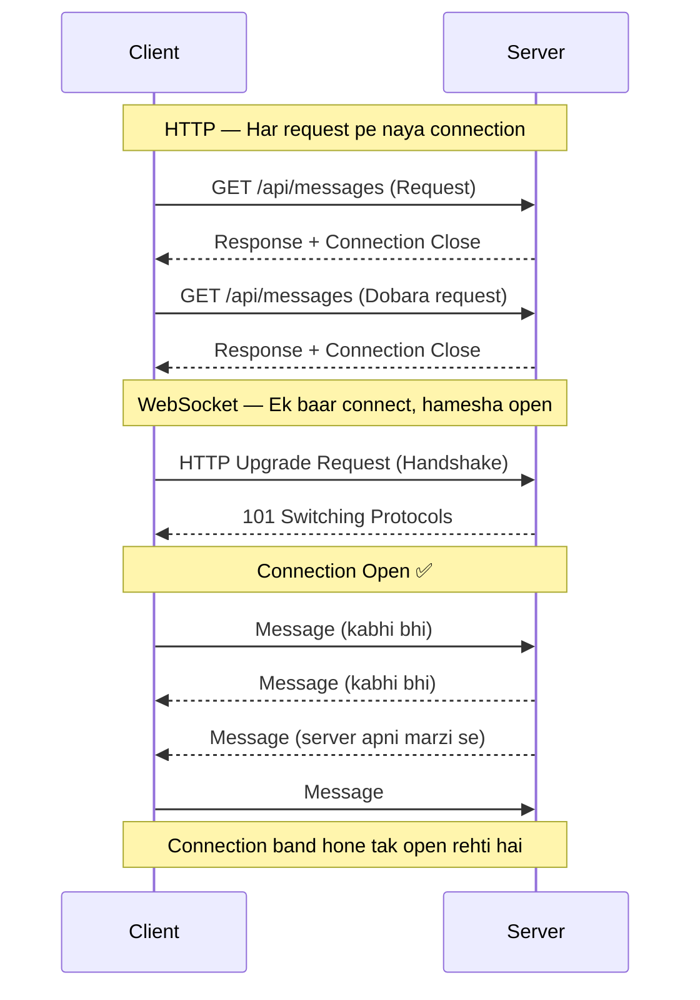

---

### WebSocket Handshake — Connection Establish Hona

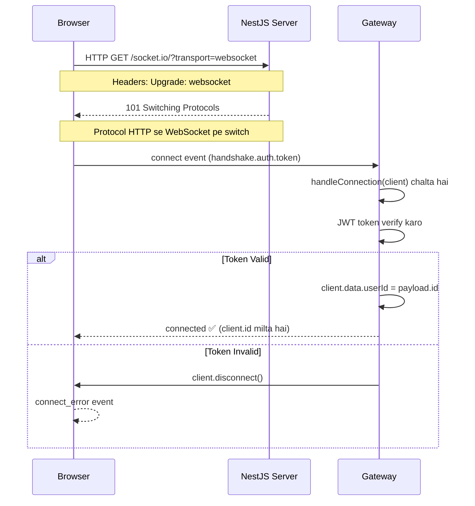

---

### Authentication Flow — JWT ke saath

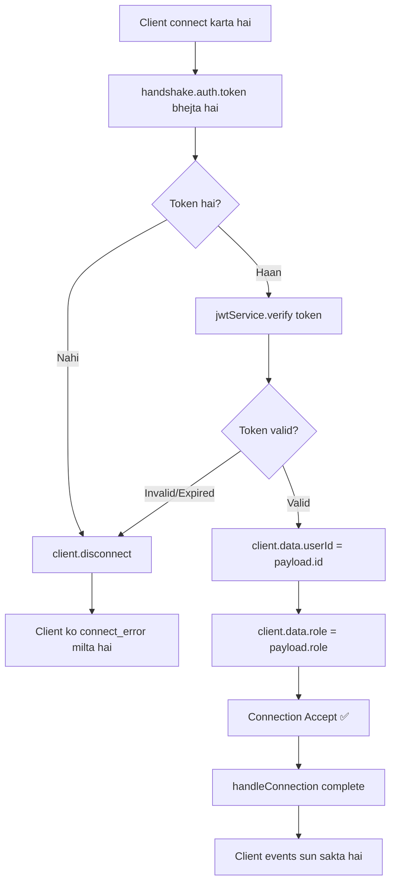

---

### Event Flow — Client se Server tak

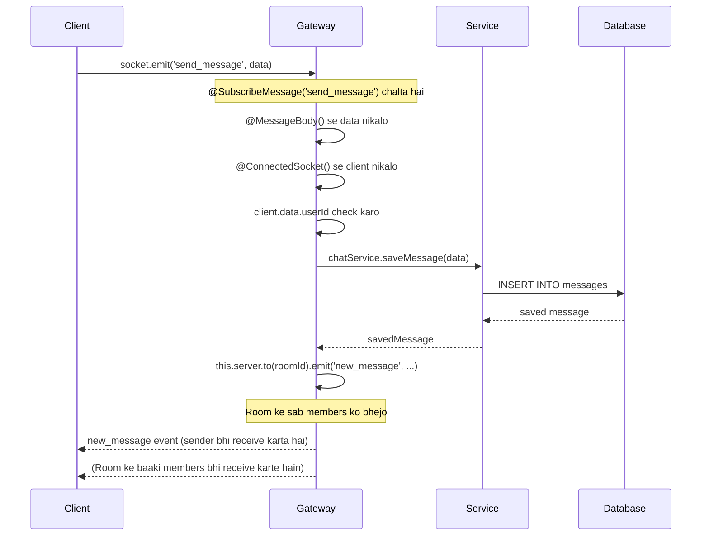

---

### Rooms — Join, Message, Leave Flow

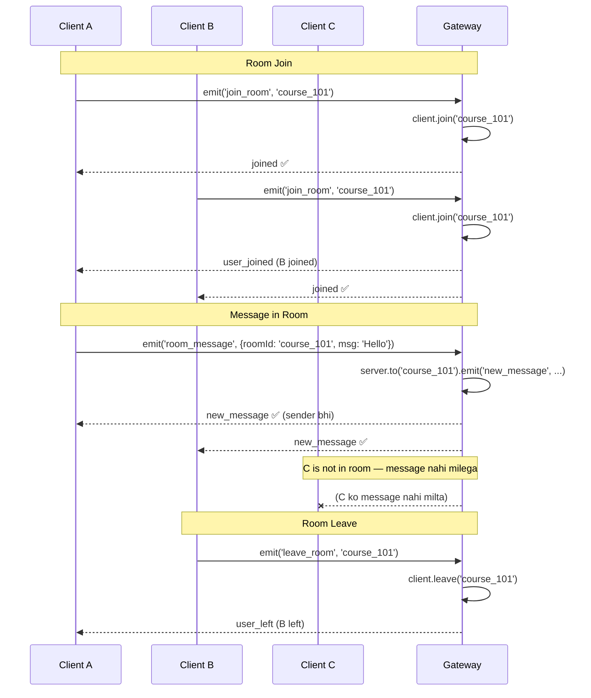

---

### Broadcasting — Sab Patterns Ek Jagah

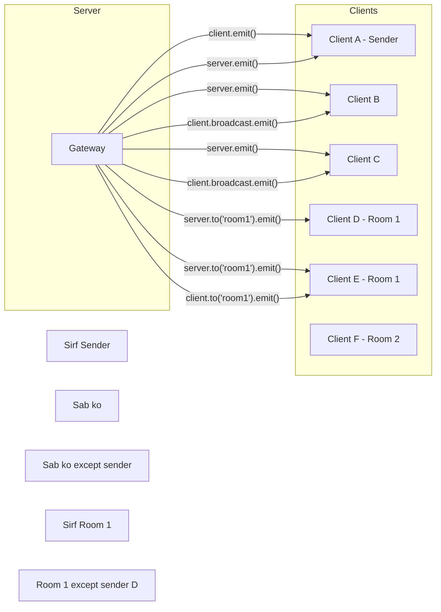

---

### Namespaces — Architecture

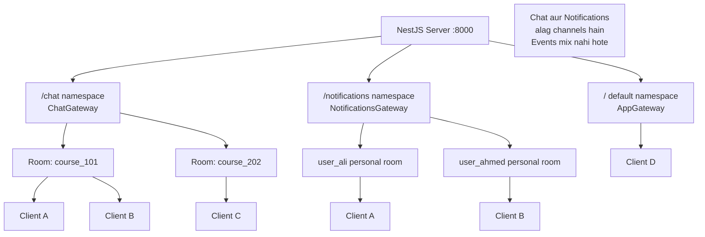

---

### HTTP + WebSocket — Combined Flow

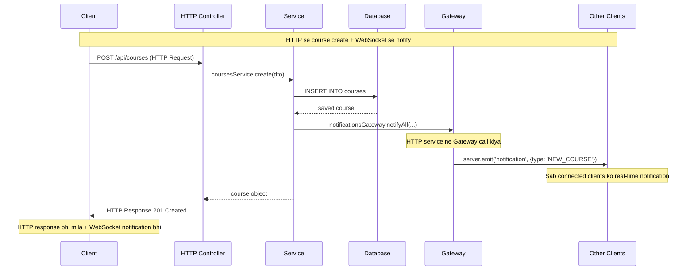

---

### Redis Adapter — Multi Server Scaling

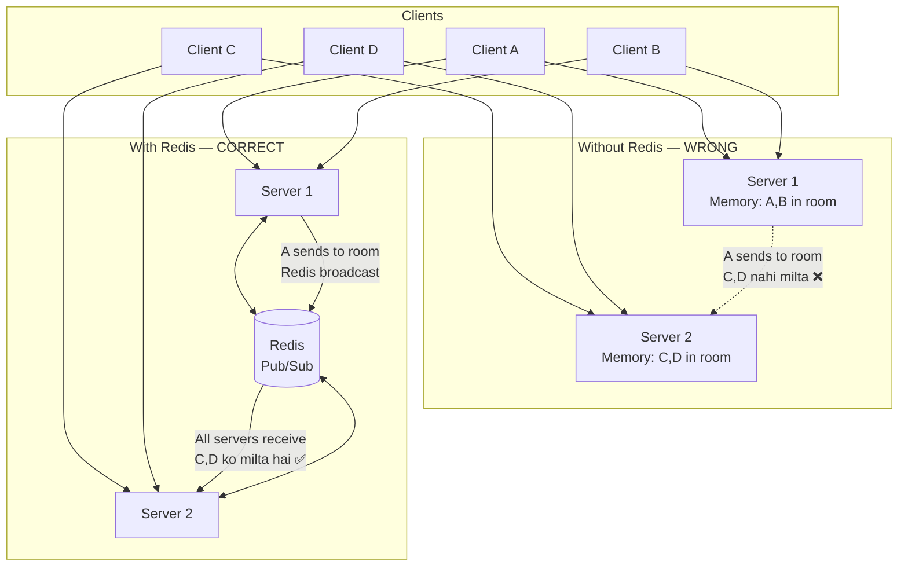

---

### Memory Leak — Problem aur Solution

```mermaid
flowchart TD
    subgraph "LEAK — Cleanup nahi kiya"
        A1[Client Connect] --> B1[Map mein add karo]
        B1 --> C1[Client Disconnect]
        C1 --> D1[Map mein rehta hai ❌]
        D1 --> E1[1000 connections = 1000 entries]
        E1 --> F1[Memory barhti rehti hai]
        F1 --> G1[Server crash 💥]
    end

    subgraph "CORRECT — Proper Cleanup"
        A2[Client Connect] --> B2[Map mein add karo]
        B2 --> C2[Client Disconnect]
        C2 --> D2[handleDisconnect chalta hai]
        D2 --> E2[Map se remove karo ✅]
        E2 --> F2[Memory stable rehti hai]
        F2 --> G2[Server healthy 💚]
    end
```

---

### Race Condition — Problem aur Solution

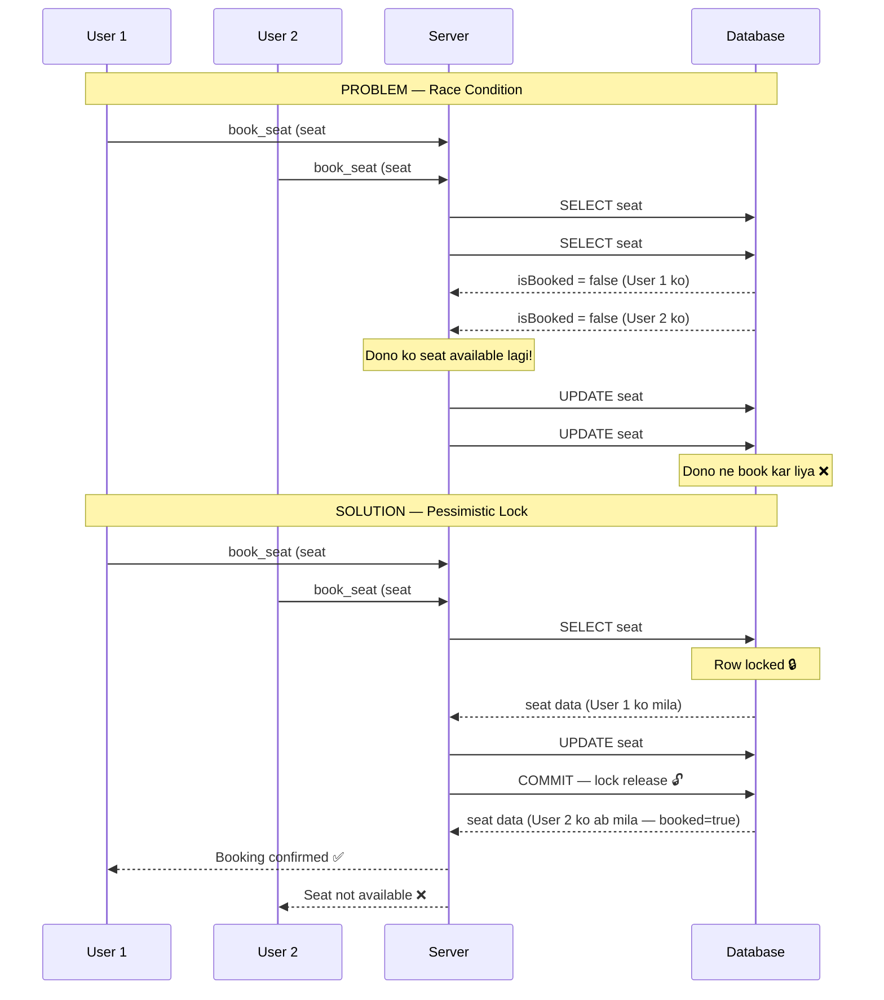

---

### Connection Lifecycle — Complete Flow

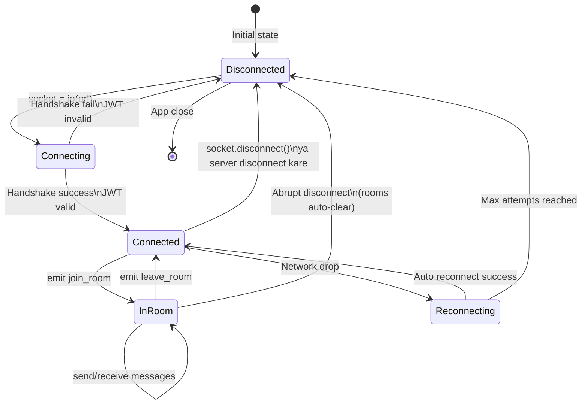

---

### Gateway Lifecycle — NestJS Startup

```mermaid
flowchart TD
    A[NestJS App Start] --> B[Module load hota hai]
    B --> C[Gateway Provider instantiate hota hai]
    C --> D[afterInit chalta hai]
    D --> E{Redis Adapter?}
    E -- Haan --> F[Redis se connect karo]
    E -- Nahi --> G[Default in-memory adapter]
    F --> H[Gateway Ready ✅]
    G --> H

    H --> I[Client connect karta hai]
    I --> J[handleConnection chalta hai]
    J --> K{JWT valid?}
    K -- Nahi --> L[client.disconnect]
    K -- Haan --> M[client.data set karo]
    M --> N[Client events sun sakta hai]

    N --> O[Client emit karta hai]
    O --> P[@SubscribeMessage handler chalta hai]
    P --> Q[Response/Broadcast]

    N --> R[Client disconnect karta hai]
    R --> S[handleDisconnect chalta hai]
    S --> T[Cleanup — Map/Set update karo]
```

---

### Chat Application — Complete Architecture

```mermaid
flowchart TD
    subgraph Frontend
        UI[Chat UI]
        SC[socket.io-client]
        UI <--> SC
    end

    subgraph Backend
        subgraph NestJS
            CG[ChatGateway\n@WebSocketGateway]
            CS[ChatService]
            NS[NotificationsGateway]
        end
        DB[(PostgreSQL\nMessages Table)]
        RD[(Redis\nAdapter)]
    end

    SC -- "WebSocket\nws://server/chat" --> CG
    CG -- "saveMessage()" --> CS
    CS -- "INSERT" --> DB
    CG -- "server.to(room).emit()" --> SC

    CG <--> RD
    NS <--> RD

    subgraph "HTTP API"
        HC[HTTP Controller]
    end

    HC -- "notifyAll()" --> NS
    NS -- "server.emit()" --> SC
```
